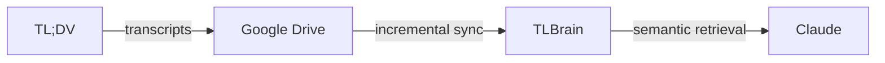

# 🧠 TLBrain `v1.0.0`

Personal semantic memory for Claude — built on top of your client calls.
 
TLBrain indexes meeting transcripts from TL;DV, stores everything in Google Drive, and lets Claude search through your conversations by meaning — without you having to paste anything manually.
 

 
Works with **claude.ai** (web) · **Claude Desktop** (Chat · Cowork · Code) · **Claude Mobile** (iOS · Android)
Google Drive + Qdrant + Gemini · Single-user · Near-zero infrastructure cost · Deploy with one command
 
---
 
## Contents
 
- [Who it's for](#-who-its-for)
- [Example queries](#-example-queries)
- [How it works in practice](#-how-it-works-in-practice)
- [Quick Start](#-quick-start)
- [Why TLBrain](#-why-tlbrain)
- [Why not just use Claude Projects?](#-why-not-just-use-claude-projects)
- [Why MCP?](#-why-mcp)
- [Cost Breakdown](#-cost-breakdown)
- [Limitations](#%EF%B8%8F-limitations)
- [Technical Architecture](#%EF%B8%8F-technical-architecture)
---
 
## 👤 Who it's for
 
Consultants, sales reps, account managers, founders — anyone with a high volume of client calls and no time to re-read transcripts.
 
---
 
## 💬 Example queries
 
> "Find what we agreed on with Acme in March regarding money"
 
> "What objections did the client raise during the last call?"
 
> "Show the conversation where we discussed extending the contract"
 
Claude retrieves the most relevant transcript fragments automatically. Saves tokens — only the relevant parts end up in context, not the full transcript. If you need more detail, ask Claude to read the full transcript from that call.
 
---
 
## 🔑 How it works in practice
 
Transcripts are automatically organized into client folders in Google Drive. If the client wasn't detected correctly — ask Claude to move it, or drag the file to the right folder manually. Either way, TLBrain picks up the change automatically.
 
Transcripts that couldn't be assigned to any client land in a special `_unassigned` folder. Claude will notify you and suggest reviewing — just move them to the right folder and they'll be re-synced automatically.
 
Noticed errors in a transcript? Fix them directly in Google Drive — TLBrain will re-sync within 15 minutes. Or ask Claude to trigger a sync immediately.
 
If Claude couldn't find the right transcript — share the Google Drive link and tell Claude what the document is about. TLBrain will remember that hint and use it in future searches.
 
Already using TL;DV? You can import your entire existing history. Best to do it in small batches — TLBrain may not recognize the client on the very first transcript, but as you correct it, it learns the pattern. Usually only the first transcript per client needs a fix.
 
You can ask Claude for a full list of clients and their sync status at any time.
 
---
 
## ⚡ Quick Start
 
**Prerequisites:** Google Cloud project, TL;DV account, Qdrant Cloud (free tier), Gemini API key.

Despite the one-command deployment, all third-party services (Google Cloud, Firebase, Qdrant, Google AI Studio) must be registered and configured manually — the steps below walk you through each one.

> Stuck at any step? Share this section of the README and a screenshot of where you are with Claude — it will give you a hint right away.
 
### 1. Create `.env`

```bash
cp .env.example .env
```

### 2. Create a Google Cloud Project
 
Open https://console.cloud.google.com/, create a new project. Recommended name: `tlbrain-prod`. Copy your **Project ID** (e.g. `tlbrain-prod-496610`).

Add to `.env`:

```env
PROJECT_ID=your-project-id
```

### 3. Install Google Cloud CLI
 
https://cloud.google.com/sdk/docs/install
 
```bash
gcloud auth login
gcloud config set project YOUR_PROJECT_ID
```

### 4. Create a Firestore Database
 
Open https://console.firebase.google.com/, on the "Create a project" page enter the project name (`tlbrain-prod`), then click the **"Add Firebase to Google Cloud project"** link at the bottom. In the dialog that opens, select your GCP project (`tlbrain-prod`). On the "Configure Google Analytics" step, disable **Google Analytics** — it is not needed for TLBrain.

Once the project is ready, go to **Firestore** in the left menu and click **Create database** with these settings:
 
- Edition: **Standard**
- Mode: **Production**
- Region: **europe-west1**
- Database ID: **(default)**

### 5. Set Up Qdrant Cloud
 
Open https://cloud.qdrant.io, create a free cluster:
 
- Name: any (e.g. `tlbrain`)
- Provider: **Google Cloud Platform**
- Region: **Frankfurt**
- Tier: **Free** (1 node, 4 GiB disk, 1 GiB RAM)

Add to `.env`:

```env
QDRANT_URL=https://YOUR-CLUSTER-URL:6333
QDRANT_API_KEY=your-qdrant-api-key
```

### 6. Create a Root Folder in Google Drive
 
Create a dedicated empty folder in Google Drive — this will be the root for all TLBrain transcripts. Don't use an existing folder with other files in it.

Client subfolders will be created automatically via MCP or manually in Google Drive.

Add to `.env`:

```env
ROOT_FOLDER_URL=https://drive.google.com/drive/folders/YOUR_FOLDER_ID
```

### 7. Configure OAuth Client
 
1. Open [APIs & Services → Audience](https://console.cloud.google.com/auth/audience), select **External**, click **Next** → **Create**
2. Open [APIs & Services → Credentials](https://console.cloud.google.com/apis/credentials)
3. **Create Credentials → OAuth client ID**, type: **Web application**, name: `TLBrain MCP`
4. On the same form, scroll down to **Authorized redirect URIs** and add:
   - `https://claude.ai/api/mcp/auth_callback`
   - `http://localhost:8085`
5. Open [APIs & Services → Audience](https://console.cloud.google.com/auth/audience) → **Publish App** → confirm

> Without publishing, refresh tokens expire every 7 days (Testing mode limitation).

Add to `.env`:

```env
GOOGLE_CLIENT_ID=your-client-id
GOOGLE_CLIENT_SECRET=your-client-secret
ALLOWED_EMAIL=your-email@gmail.com  # leave empty to skip OAuth when connecting Claude — simpler setup, but anyone with the MCP URL gets full access to your transcripts
```

### 8. Get a Gemini API Key

Open https://aistudio.google.com/apikey, create an API key.

Add to `.env`:

```env
GEMINI_API_KEY=your-gemini-api-key
```

### 9. Optional `.env` settings

```env
VERSION=1.0.0  # or latest for the most recent build
 
# Google Cloud
REGION=europe-west1
 
# Retrieval tuning
RETRIEVAL_TOP_K=15
RETRIEVAL_SCORE_THRESHOLD=0.6
 
# Sync scheduler — controls update latency after Drive changes
# "*/5 * * * *" = every 5 min  |  "*/15 * * * *" = every 15 min  |  "0 4 * * *" = daily
SYNC_CHECKER_SCHEDULE="*/15 * * * *"
 
# Cloud Tasks
VECTOR_SYNC_QUEUE=tlbrain-vector-sync-queue
CLOUD_TASKS_MAX_CONCURRENT=2
 
# Infrastructure names (Cloud Run / Cloud Function)
MCP_SERVICE_NAME=tlbrain-mcp
VECTOR_SYNC_SERVICE_NAME=tlbrain-vector-sync
SYNC_CHECKER_NAME=tlbrain-sync-checker
 
# TL;DV connector
TLDV_IMPORT_SERVICE_NAME=tlbrain-tldv-import
TLDV_IMPORT_QUEUE=tlbrain-tldv-import-queue
TLDV_WEBHOOK_FUNCTION_NAME=tlbrain-tldv-webhook
TLDV_RECONCILIATION_FUNCTION_NAME=tlbrain-tldv-reconciliation
TLDV_RECONCILIATION_SCHEDULE="0 3 * * *"
```
 
### 10. Deploy
 
```bash
bash infra/deploy/deploy.sh
```
 
Deploys the MCP server, Sync service, Cloud Tasks queue, and Sync Checker.
 
### 11. Grant Google Drive Access
 
```bash
gcloud run services describe tlbrain-vector-sync \
  --region europe-west1 \
  --format="value(spec.template.spec.serviceAccountName)"
```
 
Share your root Drive folder with this email. Recommended permission: **Editor**.
 
### 12. Connect TL;DV

In TL;DV click your avatar in the bottom-left corner → **Settings → My Account → API keys → Generate new API key**.

Add to `.env`:

```env
TLDV_API_KEY=your-tldv-api-key
```

Then deploy the connector:

```bash
bash infra/deploy/connectors/deploy_tldv.sh
```
 
After deploy, copy the webhook URL printed at the end and add it in TL;DV:
**Settings → Integrations → Webhooks → Add** → event: `TranscriptReady`.
 
### 13. Connect Claude
 
1. Open any Claude client → **Settings → MCP Servers → Add**
2. URL: `https://YOUR-MCP-URL.run.app/mcp`
3. Claude will detect OAuth automatically and prompt you to sign in with Google
4. Sign in with the same email as `ALLOWED_EMAIL`
> After each redeploy, remove the MCP server and add it again — the session is tied to the Cloud Run instance.
 
### 14. Verify
 
```bash
# Sync service logs
gcloud run services logs read tlbrain-sync --region europe-west1 --limit 50
 
# MCP service logs
gcloud run services logs read tlbrain-mcp --region europe-west1 --limit 50
 
# Health check
curl https://YOUR-SYNC-URL.run.app/
```
 
---
 
## ✅ Why TLBrain
 
| Feature | TLBrain | Typical RAG |
|---|---|---|
| Single-user optimized | ✅ | ❌ |
| Near-zero infrastructure cost | ✅ | ⚠️ |
| Conversation-aware retrieval | ✅ | ❌ |
| MCP-native (works with Claude) | ✅ | ❌ |
| Utterances stored without dense embeddings | ✅ | ❌ |
| Incremental sync (no full reindex) | ✅ | ⚠️ |
| Hybrid search (semantic + BM25) | ✅ | ⚠️ |
 
**Cheap semantic memory.** Embeddings are generated only for summaries and facts — not for every utterance. Utterances are stored with BM25 sparse vectors and retrieved by range. This drastically reduces cost and vector storage size.
 
**Works with Google Drive.** Transcripts are stored as native Google Docs — no proprietary formats. Folder = client. If something goes wrong, the data is always directly accessible.
 
**MCP-native.** Claude connects like a standard MCP server. No plugins, no custom integrations — just the protocol.
 
**Incremental sync.** One file changed — only that file gets reindexed. SHA-256 hash of content + client_name tracks both edits and moves between clients.
 
**Conversation-aware retrieval.** Retrieval works with utterance windows, not arbitrary chunks. Summaries cover overlapping ranges; facts are anchored to specific dialogue segments.
 
**Deterministic pipeline.** `temperature=0`, prompt versioning, idempotent operations. Same file → same result.
 
**No vendor lock-in.** Google Drive, Qdrant Cloud, Gemini — all on free/pay-per-use. Qdrant Cloud free tier is enough for most single-user scenarios.
 
---
 
## 🆚 Why not just use Claude Projects?
 
| | Claude Projects | TLBrain |
|---|---|---|
| Adding transcripts | Manual upload | Auto-sync from TL;DV |
| Context limit | Hits ceiling fast | Semantic retrieval — only relevant fragments |
| Structured memory | None | Facts, summaries, decisions extracted per call |
| Cost at scale | Grows with context size | Fixed ~$0.10 per transcript indexed |
| Search | Keyword / full-text | Hybrid semantic + BM25 |
| Client organization | Manual | Auto-detected, correctable |
 
Claude Projects is great for small, curated knowledge bases. TLBrain is built for ongoing workflows where new calls come in every week and you need to search across months of history without thinking about it.
 
---
 
## 🔌 Why MCP?
 
TLBrain works as a standard remote MCP server. That means Claude can use it directly — no browser extensions, no plugins, no custom UI.
 
Works with any Claude client that supports remote MCP:
 
- **claude.ai** — web
- **Claude Desktop** — Chat, Cowork, Code (macOS, Windows)
- **Claude Mobile** — iOS, Android

Connect once, use everywhere. Configuration syncs automatically across clients.
 
---
 
## 💰 Cost Breakdown
 
TLBrain is designed so you don't pay for what a single-user scenario doesn't need.
 
**Qdrant Cloud (~$0/month):**
- 1 GiB RAM, 4 GiB disk — free forever
- Utterances stored with BM25 sparse vectors (not dense) → 4× less space
- Embeddings only for summaries and facts → ~10–20% of utterance volume
- Enough for most single-user scenarios

**Gemini (~$0.10 per transcript):**
- You only pay for Gemini when indexing new transcripts
- ~$0.10 per transcript depending on conversation length
- `text-embedding-004`, `output_dimensionality=768` → 4× cheaper than 3072
- One Gemini request per window (summary + facts together)
- If a file hasn't changed, it's skipped — Gemini is never called again

**Google Cloud (~$0/month):**
- Cloud Run: free tier covers all single-user traffic
- Cloud Functions, Cloud Tasks, Cloud Scheduler: included in free tier
- Firestore: free tier covers 50k reads and 20k writes per day — more than enough for single-user at 15 calls/week

As long as you stay within the free tier limits, you only pay for syncing new transcripts — roughly $0.10 per call. Everything else is free. You can go on a six-month vacation, come back, and nothing will be lost and nothing will have cost you a penny while you were away.
 
---
 
## ⚠️ Limitations
 
- **Single-user only** — the architecture does not support multi-tenant
- **TL;DV as the primary source** — other providers require writing a connector
- **Polling sync** — changes are picked up with a delay up to `SYNC_CHECKER_SCHEDULE` (default: 15 min)
- **Drive folder depth** — only 1 level: `ROOT_FOLDER/{client_name}/`
- **Native Google Docs only** — other file formats are ignored
- **No cross-transcript aggregation yet** — a single query returns fragments from the most relevant transcript, not a summary across multiple calls. Workaround: ask Claude to search by client + date range, then ask it to read the full transcript from the results if needed

---
 
## 🏗️ Technical Architecture
 
### Services
 
**MCP Service (Cloud Run)**
- Remote MCP endpoint for Claude clients
- Retrieval pipeline (semantic + BM25 + pin)
- Google OAuth 2.0 (single-user via `ALLOWED_EMAIL`)

**Vector Sync Service (Cloud Run, scale to 0)**
- `POST /sync/doc/{doc_id}` — index a single document
- Parsing, windowing, summary/facts generation, write to Qdrant
- Firestore transactions to prevent double-processing

**Sync Checker (Cloud Function gen2)**
- Triggered by `SYNC_CHECKER_SCHEDULE` (default: `*/15 * * * *`)
- Drive Changes API — only changed files
- Recovery of stale tasks

**TL;DV Connector:**
- Webhook Function — receives `TranscriptReady`, creates a Cloud Tasks job
- Reconciliation Function — daily check of the last 48h
- Import Service (Cloud Run) — downloads transcript, detects client, creates Google Doc

### Retrieval Pipeline
 
When Claude calls `query`, six stages run:
 
**Stage 1 — Recall (three parallel searches):**
- Semantic (dense): search over summaries + facts, top-15, score ≥ 0.6 → `covered_range`
- Keyword (BM25 sparse): search over utterances, top-10 → window `[i-2, i+2]` around each hit
- Pin (user_facts): dense search over `type=user_fact`, top-10 — no score threshold; documents with matches are always included

**Stage 2 — Range merge:** merge overlapping ranges within the same document. `[121–125]` + `[123–127]` → `[121–127]`.
 
**Stage 3 — Fetch:** retrieve utterances by merged ranges — no second search query.
 
**Stage 4 — Dedup + sort:** deduplicate by `(doc_id, order_index)`, sort by `order_index ASC`.
 
**Stage 5 — Segment build:** group into dialogue segments per `doc_id`.
 
**Stage 6 — Context output:** build MCP tool result with segments and metadata.
 
### Summaries & Facts
 
During indexing, each document is processed through anchor-based windowing:
 
- **Anchor** = every Nth utterance (e.g. every 3rd)
- **Window** = `[i-2, i-1, i, i+1, i+2]` around the anchor
- Overlap between adjacent windows happens automatically

For each window — one Gemini request returning:
- **Summary** — brief description of the topic, decisions, and next steps
- **Facts** — list of structured facts (prices, objections, agreements)

Generation parameters: `temperature=0`, `top_p=1`. Prompts are versioned (`prompt_version`). Idempotency: `summary_key = doc_id + center_index + version` — if it already exists, it's skipped.
 
Utterances are always saved. A failure in summary/facts generation does not block indexing.
 
### Sync Pipeline
 
**Sync Checker** (Cloud Function, runs on schedule):
1. Fetches changes via Drive Changes API (incremental, not full scan)
2. For each changed file, computes `content_hash = sha256(file_content + client_name)`
3. If hash matches → skip; if different → enqueue reindex
4. Runs recovery: resets stale `syncing` and `downloading` records

**Vector Sync Service** (Cloud Run):
1. Receives a task from Cloud Tasks: `POST /sync/doc/{doc_id}`
2. Atomically acquires the document via Firestore transaction (`imported → syncing`)
3. Reads the Google Doc via Docs API, parses utterances and metadata
4. Generates summaries, facts, BM25 sparse vectors
5. **Append new → delete old**: uploads new chunks with new `version` first, then deletes old ones by `doc_id + old_version`
6. Updates status: `syncing → synced`

Status machine: `queued → downloading → imported → syncing → synced / error`
 
### MCP Lifecycle
 
```
Claude → initialize
Claude → tools/list
Claude → tools/call(query, ...)
     ↓
MCP Server → retrieval pipeline
     ↓
MCP Server → returns segments as tool result
     ↓
Claude → generates response based on context
```
 
The MCP server returns only context. The final response is generated by Claude.
 
Authentication: Google OAuth 2.0 Authorization Code Flow. Claude detects OAuth via discovery endpoints automatically.
 
### Storage Schema
 
**Qdrant — 4 object types:**
 
| Type | Vectors | Purpose |
|---|---|---|
| `summary` | dense (768) | Semantic search, contains `covered_range` |
| `facts` | dense (768) | Semantic search over specific facts |
| `utterance` | BM25 sparse | Keyword search + range retrieval |
| `user_fact` | dense (768) | Manual facts, protected from deletion on reindex |
 
**Firestore — 3 collections:**
 
- `transcript_index/{doc_id}` — sync status, hashes, metadata
- `clients/{client_name}` — client registry, speaker frequencies
- `config/vector_sync` — service keys (Drive page token)
### MCP Tools
 
| Tool | Description |
|---|---|
| `query` | Hybrid search (semantic + BM25) over transcripts. Filters: `client_name`, `date_from`, `date_to`. Documents with `user_facts` are always included in results. |
| `get_transcript` | Full transcripts without semantic search. By `doc_id` or `client_name` + date range. |
| `list_clients` | List of clients with dialog count and last dialog date. Unassigned transcripts are highlighted separately. |
| `add_fact` | Manually attach a fact to a transcript. Stored as `user_fact`, idempotent. |
| `create_client` | Create a client: folder in Drive + record in Firestore. |
| `move_transcript` | Move a transcript to another client. Updates Drive, resets for reindexing. |
| `import_all_transcripts` | Import all missed transcripts from TL;DV. Supports `limit` and `since`. |
| `sync_changes` | Trigger an immediate sync run without waiting for the schedule. |
| `sync_status` | Sync status counts by stage + number of unassigned transcripts. |
 
### Repository Structure
 
```
tlbrain/
├── core/                    # Shared code for both services
│   ├── config.py
│   ├── gemini/              # Embeddings + LLM
│   ├── google_drive/        # Drive client + Docs reader
│   ├── parsing/             # Parser + windowing
│   ├── qdrant/              # Client + schema + writer
│   ├── retrieval/           # Pipeline + search + segments
│   └── utils/
├── services/
│   ├── mcp/                 # MCP server
│   ├── vector_sync/         # Sync service
│   ├── sync_checker/        # Cloud Function checker
│   └── connectors/
│       └── tldv/
│           ├── import_service/
│           ├── reconciliation/
│           └── webhook/
├── infra/
│   ├── docker/
│   └── deploy/
└── .env.example
```
 
### Data Structure in Google Drive
 
```
ROOT_FOLDER/
├── _unassigned/
│   └── Some Call Title          ← Google Doc
├── Client_A/
│   └── Meeting with Acme        ← Google Doc
├── Client_B/
│   └── Demo Call Mar 1          ← Google Doc
```
 
Each subfolder = `client_name`. `_unassigned/` is a system folder for transcripts without an identified client.
 
Google Doc format:
 
```
DATE: YYYY-MM-DD
TIME: HH:MM
PROVIDER: tldv | fireflies | manual
SOURCE_FILE: original filename from the provider
---
Speaker Name :: Utterance text.
 
Speaker Name :: Utterance text.
```
 
---

 
## License
 
MIT


